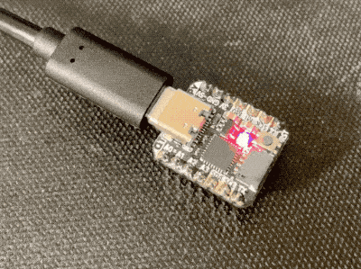
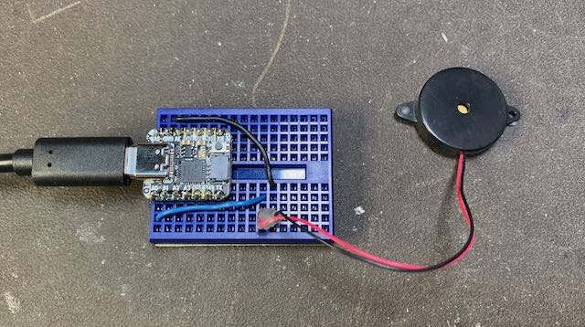
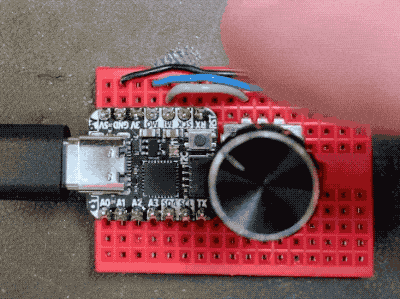

# QT Py Tricks

Some things to do on a stock [Adafruit QT Py](https://adafruit.com/qtpy)
running [CircuitPython](https://circuitpython.org) 6-beta.

These will also work on a Trinket M0 and really just about CircuitPython-compatible board,
but you may need to adjust some of the `board` pins.

Note: When copying files to QT Py or Trinket M0 and you're on a Mac,
be sure to [use the `xattr` trick described here](https://todbot.com/blog/2020/10/03/prevent-annoying-mac-_-files-being-created-on-circuitpy/)

## Table of Contents

* [Print "time" on OLED display](#print-time-on-oled-display)
* [Disco Party on built-in Neopixel](#disco-party-on-built-in-neopixel)
* [Output Farty Noises to DAC](#output-farty-noises-to-dac)
* [Capsense Touch to Colors on Built-in LED](#capsense-touch-to-colors-on-built-in-led)
* [Rotary Encoder to Built-in LED](#rotary-encoder-to-built-in-led)
* [Capsense Touch Sensor to USB keyboard](#capsense-touch-sensor-to-usb-keyboard)
         

## Print "time" on OLED display
```py
import time
import board 
import adafruit_ssd1306 # requires: adafruit_bus_device and adafruit_framebuf
i2c = board.I2C()
oled = adafruit_ssd1306.SSD1306_I2C(width=128, height=32, i2c=i2c)
while True:
    oled.fill(0)
    oled.text( "hello world", 0,0,1) # requires 'font5x8.bin'
    oled.text("time:"+str(time.monotonic()), 0,8,1)
    oled.show()
    time.sleep(1.0)
```


## Disco Party on built-in Neopixel
```py
import time
import board
import neopixel
from random import randint
pixel = neopixel.NeoPixel(board.NEOPIXEL, 1, brightness=0.2)
while True:
    pixel.fill( (randint(0,255), randint(0,255), randint(0,255) ))
    time.sleep(0.1)
```


## Output Farty Noises to DAC

```py
import time
import board 
import analogio
import random
dac = analogio.AnalogOut(board.A0)
i = 0
di = 40000
lasttime = 0
while True:
    dac.value = i
    i = (i+di) & 0xffff
    if time.monotonic() - lasttime > 1:
        lasttime = time.monotonic()
        di = random.randrange(40000,80000)
```


([hear it in action](https://twitter.com/todbot/status/1313223090181042177))


## Capsense Touch to Colors on Built-in LED

```py
import board
from touchio import TouchIn
import neopixel
pixel = neopixel.NeoPixel(board.NEOPIXEL, 1, brightness=0.2)
touchA = TouchIn(board.A1)
touchB = TouchIn(board.A2)
print("hello")
while True:
  pixel[0] = (int(touchA.value*255), 0, int(touchB.value*255))
```


## Rotary Encoder to Built-in LED

```py
import board
import time
import neopixel
import rotaryio
pixel = neopixel.NeoPixel(board.NEOPIXEL, 1, brightness=1.0)
encoder = rotaryio.IncrementalEncoder( board.MOSI, board.MISO ) # any two pins
while True:
    b = (encoder.position % 32) * 8
    print(encoder.position,b)
    pixel.fill((0,0,b))
    time.sleep(0.1)
```



## Capsense Touch Sensor to USB keyboard

```py
import time
import board 
import neopixel
import touchio
import usb_hid
from adafruit_hid.keyboard import Keyboard
from adafruit_hid.keycode import Keycode
touchA= touchio.TouchIn(board.A0)
pixel = neopixel.NeoPixel(board.NEOPIXEL, 1, brightness=0.2, auto_write=False)
pixel[0] = (0,0,0)
time.sleep(1)  # Sleep for a bit to avoid a race condition on some systems
kbd = Keyboard(usb_hid.devices)
while True:
    if touchA.value:
        print("A press")
        pixel[0] = (255,0,0)
        kbd.send(Keycode.RIGHT_ARROW)
    pixel.show()
    pixel[0] = (0,0,0)
    time.sleep(0.2)
```

