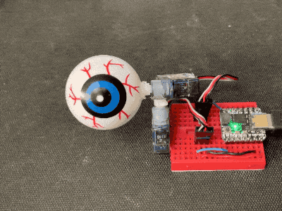
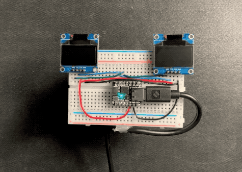
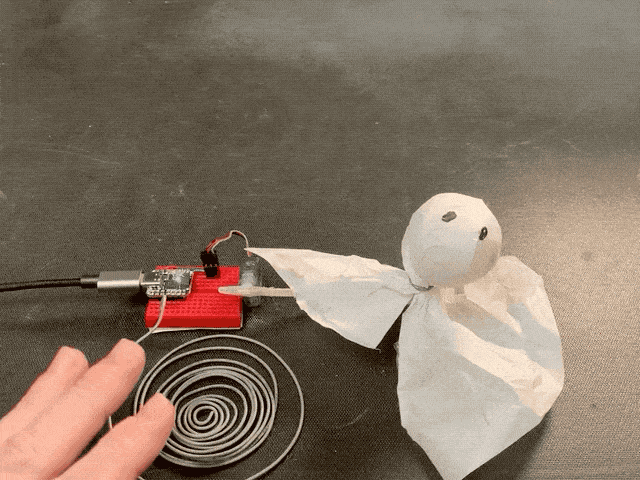
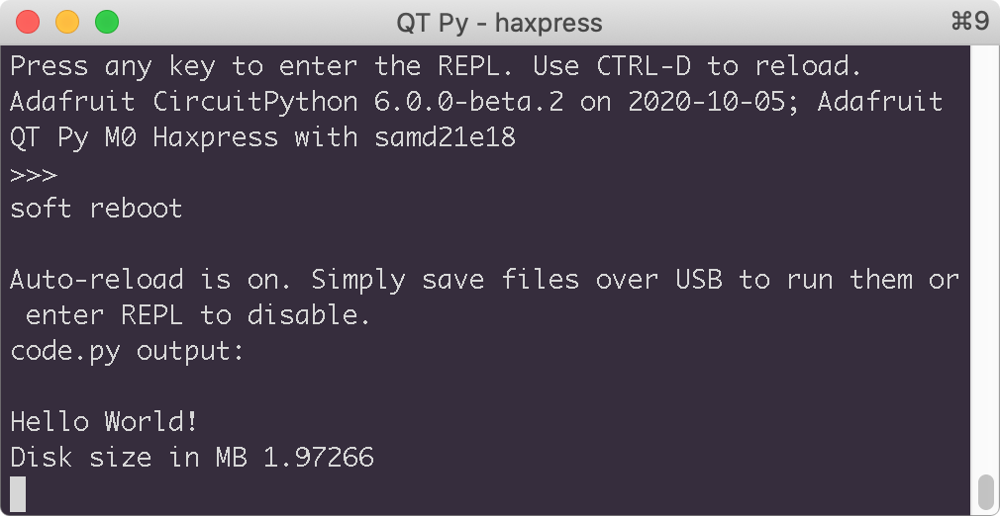

# QT Py Tricks

Some things to do on a stock [Adafruit QT Py](https://adafruit.com/qtpy)
running [CircuitPython](https://circuitpython.org) 6.
This list is mostly to help me remmeber how to do things in CircuitPython.
Fore more general [CircuitPython tricks](https://github.com/todbot/circuitpython-tricks), check out my [CircuitPython Tricks page](https://github.com/todbot/circuitpython-tricks).

These code snippets will also work on a Trinket M0 and really just about
CircuitPython-compatible board, but you may need to adjust some of the `board` pins.

Notes:
- You will need to copy needed libraries from the [CircuitPython libraries bundle](https://circuitpython.org/libraries) to your CIRCUITPY drive
- When copying files to QT Py or Trinket M0, and you're on a Mac,
be sure to [use the `xattr` trick described here](https://todbot.com/blog/2020/10/03/prevent-annoying-mac-_-files-being-created-on-circuitpy/) to save flash space
- Or, just use [`circup`](https://learn.adafruit.com/keep-your-circuitpython-libraries-on-devices-up-to-date-with-circup/install-circup) to install libraries. It's very nice! (on Mac, do `pip3 install circup`)

## Table of Contents

* [Print "time" on OLED display](#print-time-on-oled-display)
* [Disco Party on built-in Neopixel](#disco-party-on-built-in-neopixel)
* [Output Farty Noises to DAC](#output-farty-noises-to-dac)
* [Capsense Touch to Colors on Built-in LED](#capsense-touch-to-colors-on-built-in-led)
* [Rotary Encoder to Built-in LED](#rotary-encoder-to-built-in-led)
* [Fire Simulation on External Neopixel Strip](#fire-simulation-on-external-neopixel-strip)
* [Two servos with Python Class for Easing / Sequencing](#two-servos-with-python-class-for-easing--sequencing)
* [Spooky Eyes with Dual SSD1306 OLED displays](#spooky-eyes-with-dual-ssd1306-oled-displays)
* [Use Capsense as Proximity Detector to Make Spooopy Ghost](#use-capsense-as-proximity-detector-to-make-spooopy-ghost)
* [Get Size of Device's Flash Disk](#get-size-of-devices-flash-disk)
* [Capsense Touch Sensor to USB keyboard](#capsense-touch-sensor-to-usb-keyboard)
         

## Print "time" on OLED display

[Note: as of CircuitPython 7, this only works on QTPy RP2040, not QTPy M0 or QTPY M0 Haxpress]

```py
import time
import board 
import adafruit_ssd1306 # requires: adafruit_bus_device and adafruit_framebuf
i2c = board.I2C()
oled = adafruit_ssd1306.SSD1306_I2C(width=128, height=32, i2c=i2c)
while True:
    oled.fill(0)
    oled.text( "hello world", 0,0,1) # requires 'font5x8.bin'
    oled.text("time:"+str(time.monotonic()), 0,8,1)
    oled.show()
    time.sleep(1.0)
```


## Disco Party on built-in Neopixel
```py
import time
import board
import neopixel
from random import randint
pixel = neopixel.NeoPixel(board.NEOPIXEL, 1, brightness=0.2)
while True:
    pixel.fill( (randint(0,255), randint(0,255), randint(0,255) ))
    time.sleep(0.1)
```


## Output Farty Noises to DAC

```py
import time
import board 
import analogio
import random
dac = analogio.AnalogOut(board.A0)
i = 0
di = 40000
lasttime = 0
while True:
    dac.value = i
    i = (i+di) & 0xffff
    if time.monotonic() - lasttime > 1:
        lasttime = time.monotonic()
        di = random.randrange(40000,80000)
```


([hear it in action](https://twitter.com/todbot/status/1313223090181042177))


## Capsense Touch to Colors on Built-in LED

```py
import board
from touchio import TouchIn
import neopixel
pixel = neopixel.NeoPixel(board.NEOPIXEL, 1, brightness=0.2)
touchA = TouchIn(board.A1)
touchB = TouchIn(board.A2)
print("hello")
while True:
  pixel[0] = (int(touchA.value*255), 0, int(touchB.value*255))
```


## Rotary Encoder to Built-in LED

```py
import board
import time
import neopixel
import rotaryio
pixel = neopixel.NeoPixel(board.NEOPIXEL, 1, brightness=1.0)
encoder = rotaryio.IncrementalEncoder( board.MOSI, board.MISO ) # any two pins
while True:
    b = (encoder.position % 32) * 8
    print(encoder.position,b)
    pixel.fill((0,0,b))
    time.sleep(0.1)
```


## Fire Simulation on External Neopixel Strip
Uses Python array operations and list comprehensions for conciseness.

```py
import board
import time
import neopixel
from random import randint
# External Neopixel strip, can be on any pin
leds = neopixel.NeoPixel(board.RX,8,brightness=0.2,auto_write=False)
while True:
    # reduce brightness of all pixels by (30,30,30)
    leds[:] = [[max(i-30,0) for i in l] for l in leds]
    # shift LED values up by one (0->1, 1->2, etc)
    leds[1:] = leds[0:-1] # '-1' means len-1 here
    # pick new random fire color for LED 0
    leds[0] = (randint(150,255),randint(50,100),0) 
    leds.show()
    time.sleep(0.1)
```


If you want it "flipped", so the fire goes from the top LED down to LED 0:

```py
import time, board, neopixel
from random import randint
leds = neopixel.NeoPixel(board.RX,8,brightness=0.2,auto_write=False)
while True:
    leds[:] = [[max(i-30,0) for i in l] for l in leds] # reduce brightness of all pixels by (30,30,30)
    leds[0:-1] = leds[1:]                              # shift LED values down by one
    leds[-1] = (randint(150,255),randint(50,100),0)    # pick new random fire color for LED N
    leds.show()
    time.sleep(0.1)
```


##  Two servos with Python Class for Easing / Sequencing

```py
import board
import time
from pulseio import PWMOut
from adafruit_motor import servo
from random import random

servoA = servo.Servo(PWMOut(board.RX, duty_cycle=2**15, frequency=50))
servoB = servo.Servo(PWMOut(board.TX, duty_cycle=2**15, frequency=50))

class AngleSequence:
    def __init__(self,angles,speed):
        self.angles = angles
        self.aindex = 0
        self.angle = angles[0]
        self.speed = speed
    def next_angle(self):
        self.aindex = (self.aindex + 1) % len(self.angles)
    def update(self):
        new_angle = self.angles[self.aindex]
        self.angle += (new_angle - self.angle) * self.speed  # simple easing
        return self.angle

seqA = AngleSequence( [90,70,90,90,90,90,60,80,100], 0.1) # set speed to taste
seqB = AngleSequence( [90,90,90,80,70,90,120], 0.1) # set angles for desired animation

lasttime = time.monotonic()
while True:
    if time.monotonic() - lasttime > (0.2 + random()*4.0  ):  # creepy random timing
        lasttime = time.monotonic()
        seqA.next_angle() # go to next angle in list
        seqB.next_angle()
    servoA.angle = seqA.update() # get updated (eased) servo angle
    servoB.angle = seqB.update()
    time.sleep(0.02) # wait a bit, note this affects 'speed'
```



## Spooky Eyes with Dual SSD1306 OLED displays

Displays are at same address, so code can be much simpler

[Note: as of CircuitPython 7, this only works on QTPy RP2040, not QTPy M0 or QTPY M0 Haxpress]

```py
import time
import board 
import random
import adafruit_ssd1306 # requires: adafruit_bus_device, adafruit_framebuf
i2c = board.I2C()
oled = adafruit_ssd1306.SSD1306_I2C(width=128, height=64, i2c=i2c)
i=0; inc=30
while True:
    oled.fill(0)
    for d in (31,30,14,12,10,8):  # various diameters
        oled.circle( 64+i,32, d,1)
    i = random.randint(-30,30)
    oled.show()
    time.sleep( 0.1 + random.random() )
```



## Use Capsense as Proximity Detector to Make Spooopy Ghost
Computing the difference between current touch raw value anda baseline minimum
provides a kind of proximity detector, if your antenna is big enough.

```py
import time
import board
import digitalio
import touchio
from pulseio import PWMOut
from adafruit_motor import servo

touchA = touchio.TouchIn(board.A2)
servoA = servo.Servo(PWMOut(board.RX, duty_cycle=2**15, frequency=50))
touch_min = touchA.raw_value  # baseline for proximity
servo_pos_last = 160

while True:
    # get proximity value, set within servo bounds (30-160)
    proximity_val = (touchA.raw_value - touch_min)
    servo_pos = 160 - min(160, max(30, proximity_val))
    servo_pos_last += (servo_pos - servo_pos_last) * 0.01  # easing/smoothing
    servoA.angle = servo_pos_last
```




## Get Size of Device's Flash Disk
see [`os.statvfs()` docs](https://circuitpython.readthedocs.io/en/latest/shared-bindings/os/index.html#os.statvfs)

```py
import os
print("\nHello World!")
fs_stat = os.statvfs('/') 
print("Disk size in MB", fs_stat[0] * fs_stat[2] / 1024 / 1024)
print("Free space in MB", fs_stat[0] * fs_stat[3] / 1024 / 1024)
while True: pass
```



## Capsense Touch Sensor to USB keyboard
```py
import time
import board 
import neopixel
import touchio
import usb_hid
from adafruit_hid.keyboard import Keyboard
from adafruit_hid.keycode import Keycode
touchA= touchio.TouchIn(board.A0)
pixel = neopixel.NeoPixel(board.NEOPIXEL, 1, brightness=0.2, auto_write=False)
pixel[0] = (0,0,0)
time.sleep(1)  # Sleep for a bit to avoid a race condition on some systems
kbd = Keyboard(usb_hid.devices)
while True:
    if touchA.value:
        print("A press")
        pixel[0] = (255,0,0)
        kbd.send(Keycode.RIGHT_ARROW)
    pixel.show()
    pixel[0] = (0,0,0)
    time.sleep(0.2)
```

***

# Really Helpful CircuitPython Links

- https://circuitpython.readthedocs.io/projects/bundle/en/latest/drivers.html
- https://circuitpython.readthedocs.io/en/latest/shared-bindings/support_matrix.html
- https://learn.adafruit.com/circuitpython-essentials/circuitpython-essentials
- https://learn.adafruit.com/welcome-to-circuitpython/overview
